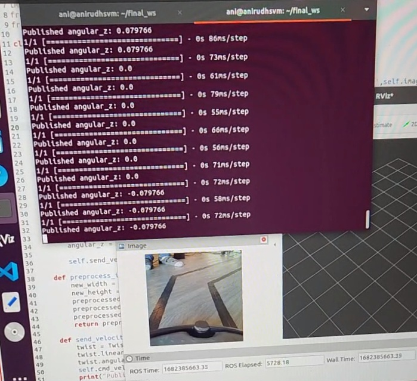
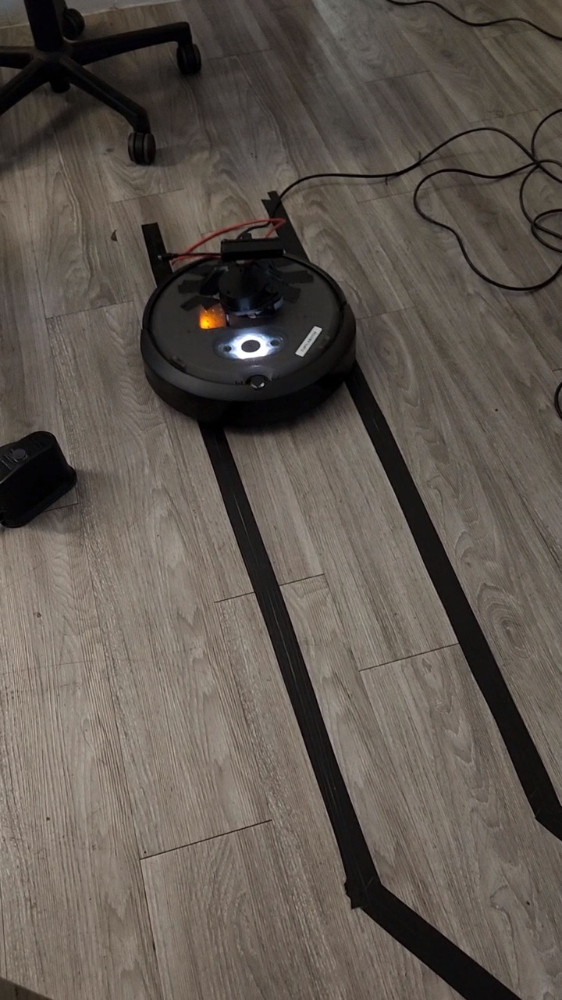
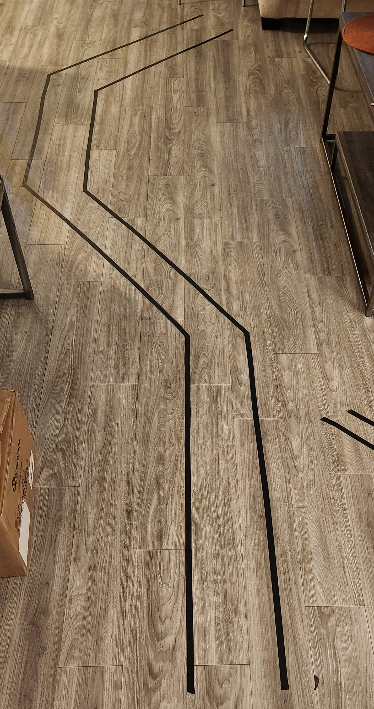

# TurtleBot Lane following with Deep Neural Networks (Computer Vision)

** Project Contributors: **

|    Name                                |        Email          |
| -----------                            | --------------------- |
| Mohammad Zaki Patel                    |_mmpate15@asu.edu_     |
| Anirudh Varadarajan                    |_anirudhv012@gmail.com_|
| Harkirat Singh Chahal                  |_hchahal1@asu.edu_     |

## Home

Final project repository for EGR598: Experimentation and Deployment of Robotic Systems using ROS II and TurtleBot. In this repository, you can find the code, documentation, and other resources related to our project, which focuses on developing and deploying lane following with Deep Neural Network using Python, ROS 2 and the TurtleBot platform.

## Project Overview

 

  
  
  

  
<!--  -->

 

## Project scope

The impact of developing a neural network-based solution for autonomous path following for robots is significant, as it can contribute to the development of more advanced and efficient autonomous robots for a variety of applications such as autonomous cars, drones, warehouse material handling robots, etc. Deep Learning techniques provides better learning opportunities for the robot to perform a task as compared to traditional hard coding. This project will drive us to learn new material related to deep learning and computer vision, as well as reinforce our knowledge of robotics and ROS. This project will encourage learning in topics such as systems integration, data collection, data preprocessing, machine learning model design, performance evaluation, which are essential skills for a end-to-end robotics projects with Neural Network application. It will also provide an opportunity to explore different neural network architectures and their applications in robotics. Overall, this project will help me develop a more comprehensive understanding and hands-on experience systems integration and machine learning applications in robotics.

## Project Code Files

#### Link to dataset
https://www.dropbox.com/scl/fo/lxusvspekpv4ozj5xrrr2/h?dl=0&rlkey=1yb1fyo3akn8ggwnnz4a0q54x

#### [1. Link to the full workspace](Code/final_ws.rar)
We provide our full ROS II - Galactic workspace to run the project scripts for data collection and steering angle prediction.
Note: Make sure to add your own pre-trained model weights in the workspace folder. 

#### [2. Data Collection script](Code/data_collect.py)

Our initial data collection code enables manual control of the TurtleBot using the keyboard and collects data in the form of images from the /color/preview/image topic and steering angles from the /cmd_vel topic. The data is saved every second as a .csv file with a unique timestamp extension for each data point. 

#### [3. Machine Learning (Computer Vision) - Notebook](Code/machine_learning.ipynb)

Our machine learning code uses computer vision techniques to classify images and predict steering angles for the task of lane/path following. We have developed our own classification model that uses frame-by-frame images and classifies them as straight (0), right adjust (0.79), or left adjust (-0.79) based on the view of the path. We have trained the model using both a pre-trained model and one developed from scratch. 

#### [4. Steering angle prediction and deployment script](Code/vel_subscriber.py)

Our final code implements a machine learning model on the TurtleBot for lane/path following tasks. The input data is captured as images, and each frame is fed through the machine learning model to output a predicted steering value. The /cmd_vel topic uses this predicted steering value to adjust the TurtleBot's movement within the lane. This code is designed to enable efficient and accurate lane following with the TurtleBot platform using machine learning techniques.
